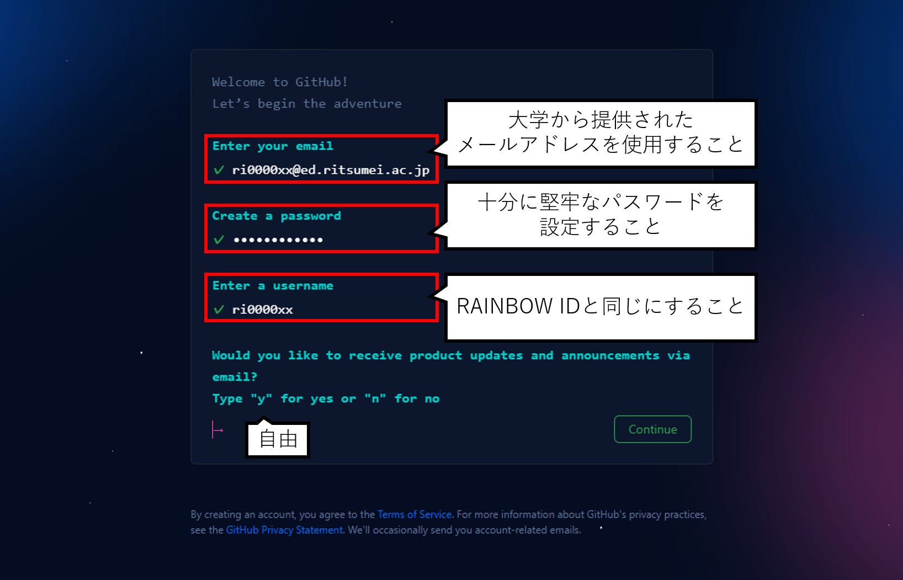

# アカウントの作成

今後GitHubのサイトデザインが変わる可能性があるため，画像と違う場合は適宜読み替えてください．

[GitHub](https://github.com/)にアクセスし，右上の`Sign up`をクリック

メールアドレス・パスワードを入力する．
- 大学から提供されているメールアドレスを使用すること．
- 十分に堅牢なパスワードを設定すること
- ユーザー名はRAINBOW IDと同じにすること．

登録したメールアドレスにGitHubからメールが来るので，メール内の`verify email address`ボタンを押し，メールアドレスの確認を完了する．

[GitHub](https://github.com/)にアクセスし，登録したユーザ名とパスワードでサインインできることを確認する．