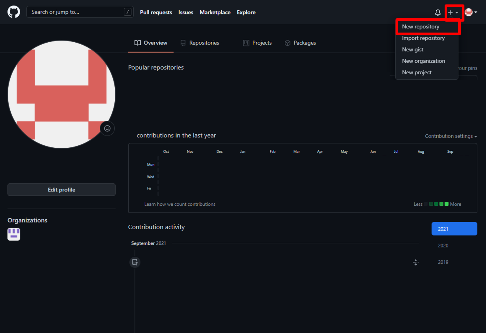
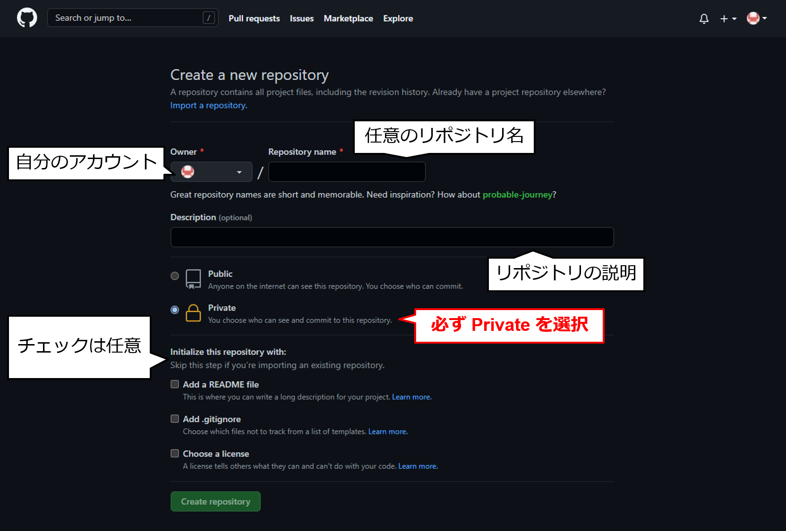

# 個人リポジトリの作成

右上の`+`マークから`New repository`を選択

- Ownerが自分のアカウントになっていることを確認する
- 任意のリポジトリ名を設定する
- リポジトリの説明を書く (省略可)
- 必ず`Private`にチェックを入れる (研究室内の情報を外部に公開しないため)
- `Initialize this repository with: `以下のチェックは任意

`Create repository`ボタンを押して，リポジトリを作成する．

必要に応じて以下を参照．

[リモートリポジトリとローカルリポジトリを関連付ける](./link_repo.md)