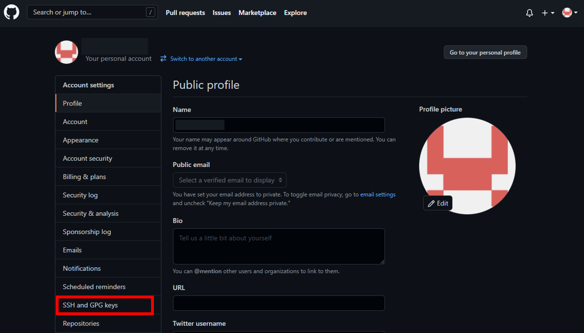
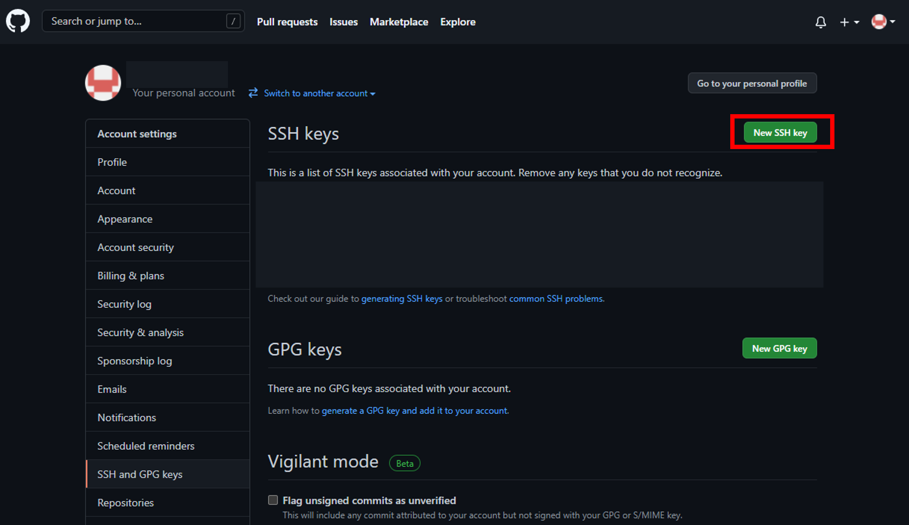
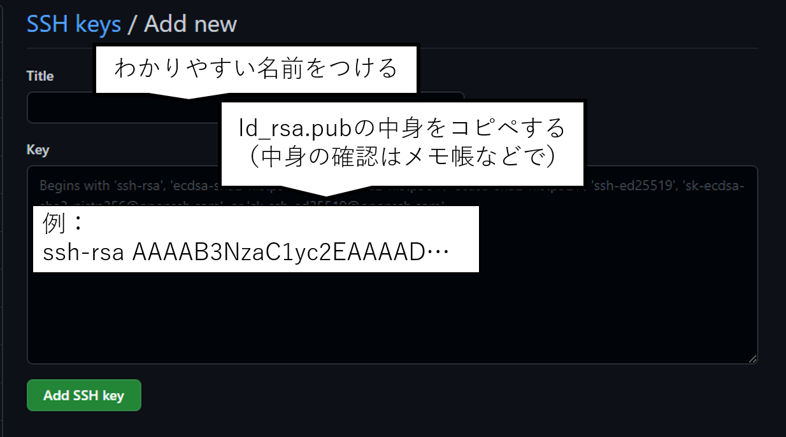

# Git環境の構築

必要に応じて[Git Documentation](https://git-scm.com/doc)を確認することを勧める．

## Windows

### Gitクライアントのインストール

[Git公式サイト](https://git-for-windows.github.io/)にアクセスし，インストーラをダウンロードする

インストーラを起動し，インストールを開始する．

設定は好みで．ただし，デフォルトエディタは初期設定だとVimになっているので，慣れていない人は変えたほうがよい(Nano, Notepadなど)．

### 公開鍵ペアの作成と登録

Gitコマンドを介してGitHubとやりとりを行うためには，公開鍵認証が必要になる．
1. Windowsキーを押し，検索窓に`cmd`と打ち込み，コマンドプロンプトを起動する．
1. `$ ssh-keygen`と打ち込み，実行する．
1. `Enter file in which to save the key (C:\Users\<ユーザ名>/.ssh/id_rsa):`は保存先を聞かれているので，基本的には何も書かずにEnterを押す．
1. `Enter passphrase (empty for no passphrase):`は秘密鍵をほどくためのパスフレーズを聞かれているので，任意のパスワードを設定する．何も入力せずにEnterを押すと省略できる(秘密鍵が暗号化されない)．
1. `Enter same passphrase again:`上記のパスワードを再入力する．何も入力しなかった場合はそのままEnterを押す．
1. `C:\Users\<ユーザ名>\.ssh\`に`id_rsa`(秘密鍵)と`id_rsa.pub`(公開鍵)が作成されている．

`C:\Users\<ユーザ名>\.ssh\`へのアクセスは，エクスプローラから`PC`->`ローカルディスク(C:)`->`ユーザー`->`<Windowsユーザ名>`->`.ssh`である．

[初期設定へ](#初期設定)

## Linux

### Gitクライアントのインストール

Gitをインストールする

```bash
$ sudo apt install git-all  # Debian/Ubuntu
$ sudo yum install git-all  # Fedora
```

### 公開鍵ペアの作成と登録

Gitコマンドを介してGitHubとやりとりを行うためには，公開鍵認証が必要になる．
1. `$ ssh-keygen`と打ち込み，実行する．
1. `Enter file in which to save the key (/home/<ユーザ名>/.ssh/id_rsa): `は保存先を聞かれているので，基本的には何も書かずにEnterを押す．
1. `Enter passphrase (empty for no passphrase):`は秘密鍵をほどくためのパスフレーズを聞かれているので，任意のパスワードを設定する．何も入力せずにEnterを押すと省略できる(秘密鍵が暗号化されない)．
1. `Enter same passphrase again:`上記のパスワードを再入力する．何も入力しなかった場合はそのままEnterを押す．
1. `/home/<ユーザ名>/.ssh/`に`id_rsa`(秘密鍵)と`id_rsa.pub`(公開鍵)が作成されている．

[初期設定へ](#初期設定)

## 初期設定

### Gitの設定
`git config`の設定をする必要がある．

特に，`user.name`と`user.email`は設定されていないとGitの様々な機能が使えなくなる．

Gitの設定ファイルは以下の3種類があるが，基本的には`global`を設定すればよい．
- `system`: システム全体(全ユーザ)の設定
- `global`: 現在のユーザの設定
- `local`: 現在のリポジトリの設定

(例)
```bash
$ git config --global user.name fujinolab
$ git config --global user.name ri0000xx@ed.ritsumei.ac.jp
```

設定された値を確認するには以下のコマンドが使用できる．

(例)
```bash
$ git config -l
user.name=fujinolab
user.email=ri0000xx@ed.ritsumei.ac.jp
```

### GitHubへの公開鍵の登録

GitHubに接続・ログインし，`Settings`->`SSH`->`Add SSH key`ボタンから`id_rsa.pub`(公開鍵)を登録する．






コマンドプロンプト，もしくはBashからGitHubに対してSSH接続を試行し，以下のような返答が帰ってくれば成功している．
```bash
$ ssh -T git@github.com
Hi <ユーザ名>! You've successfully authenticated, but GitHub does not provide shell access.
```

GitHubに接続するPCが複数台ある場合は，それぞれのPCで公開鍵の作成(上記Windows/Linux手順参照)を行い，公開鍵をGitHubに追加していく．

この際に登録した鍵の見分けがつくよう，登録時に適切な名前をつけておく必要がある．