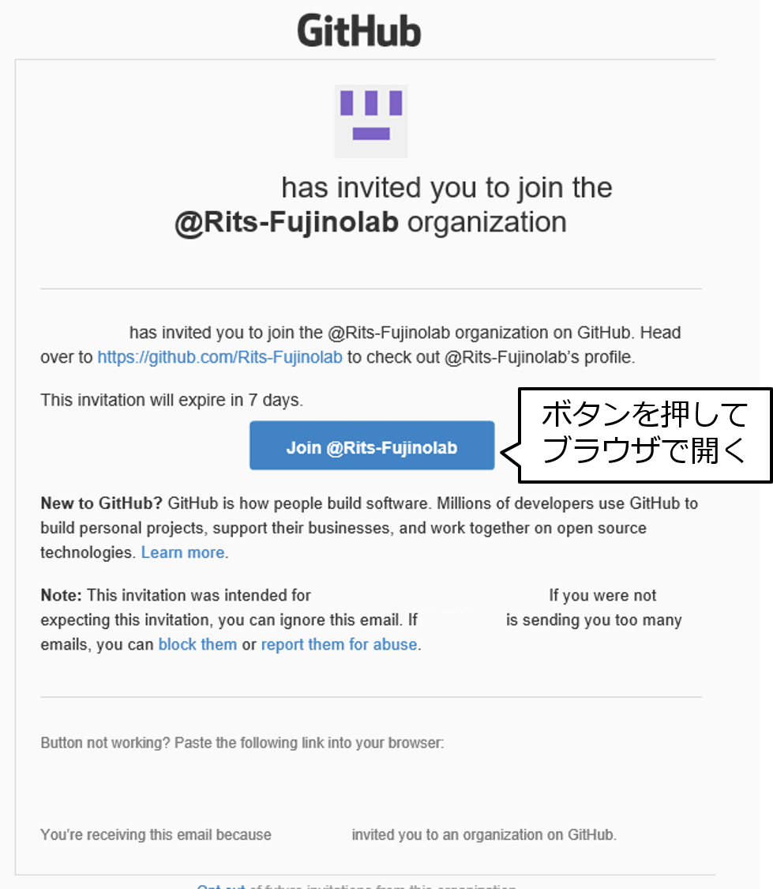
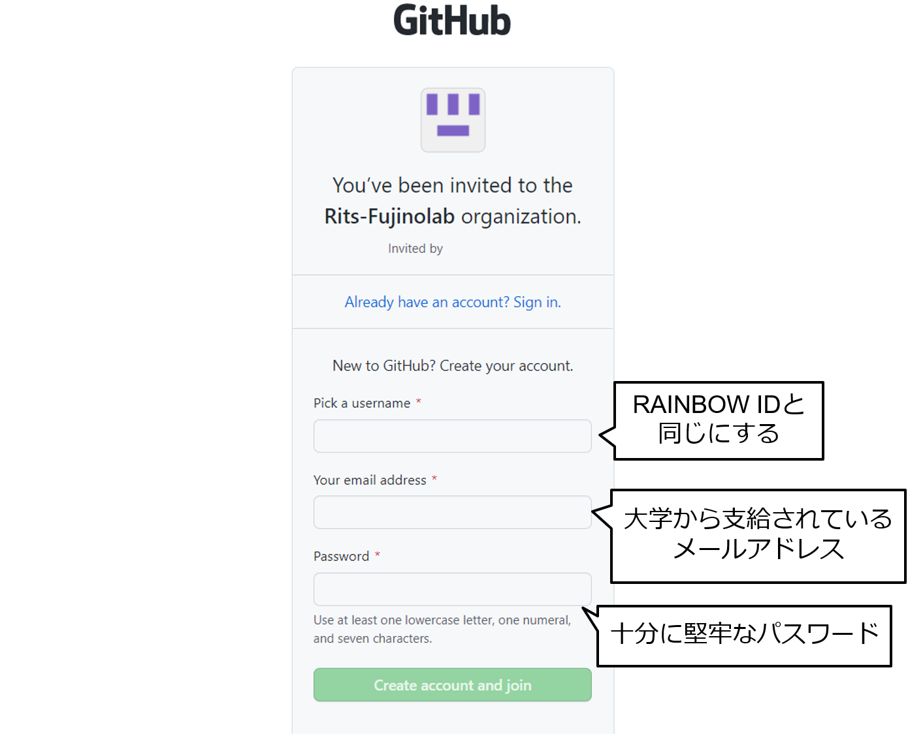
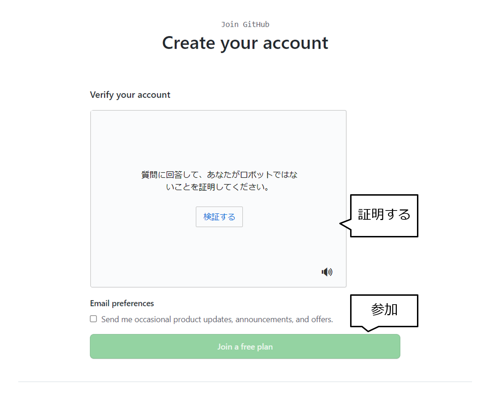

# 組織に参加する

## 招待メールを受け取る

組織の管理者から以下のような招待メールを受け取る．
`Join @Ritsu-Fujinolab` ボタンを押してブラウザを開く．

## アカウントを作成・参加する

既に大学のメールアドレスでアカウントを作成している場合は，`Already have an account? Sign in.`を選択してログインする．

- ユーザ名はRAINBOW IDを使用すること (例：ri0000xx)
- メールアドレスは大学のものを使用すること (例：ri0000xx@ed.ritsumei.ac.jp)
- パスワードは十分に堅牢なものを設定すること

