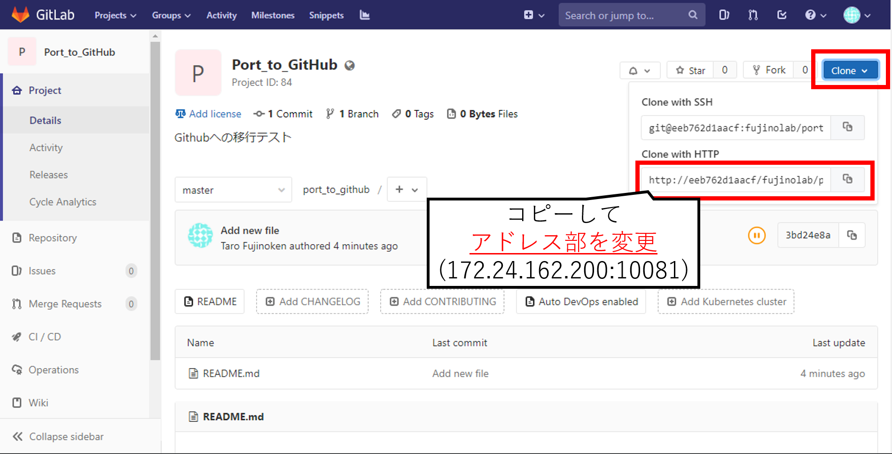
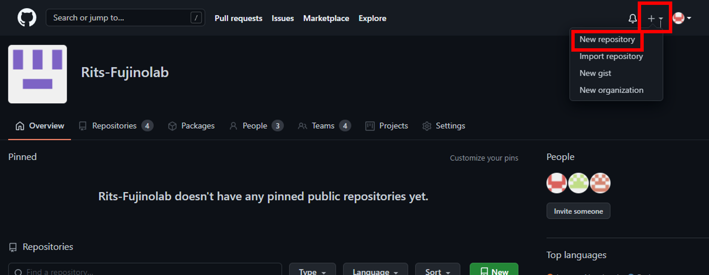
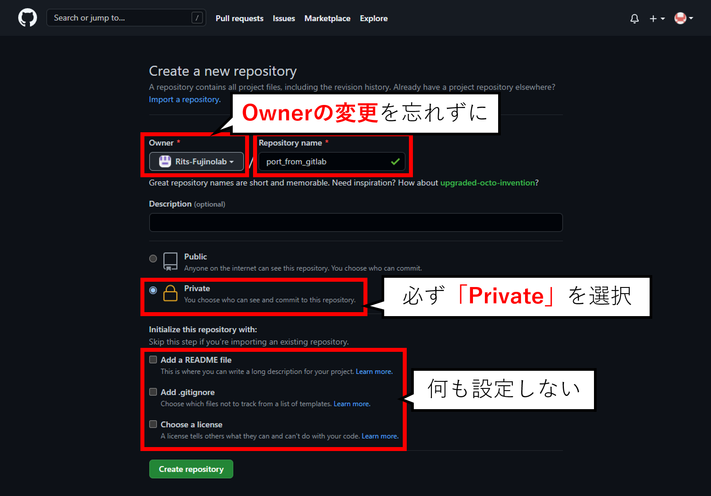
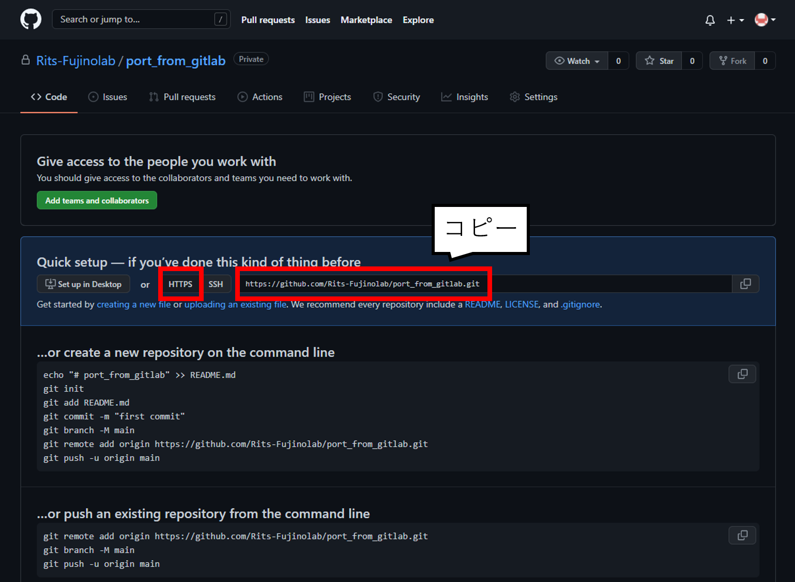
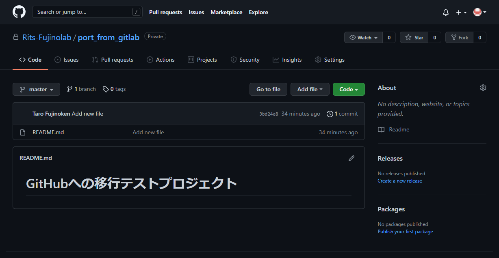

# 研究室内GitLab環境からの移行手順

研究室内GitLab環境は停止予定のため，GitHubへの移行をお願いします．

## GitLab上のリポジトリをGitHub上のリポジトリに移動する

GitHubアカウントが作成されており，Rits-Fujinolabに登録されている必要がある．

- [GitHubアカウントの作成](../howto/create_account.md)
- [Rits-Fujinolabへのメンバ追加 (管理者)](../admin/add_member.md)

ローカルPCにGitの環境を作成しておく必要がある．
- [Git環境の構築](../howto/git_setup.md)

-----
### 1. GitLabのリポジトリをローカルにクローンする

GitLabの該当のプロジェクトに移動し，右上の`clone`ボタンをクリック

`Clone with HTTP`にあるアドレスをコピーし，アドレス部(この例では`eeb762d1aacf`)を`172.24.162.200:10081`に変更する

ローカルにクローンする (以下は例)
```bash
$ git clone http://172.24.162.200:10081/fujinolab/port_to_github.git
```



### 2. GitHub上に移行先のリポジトリを作成する

GitHub上の[Rits-Fujinolab](https://github.com/Rits-Fujinolab)リポジトリにアクセスする

右上の`+`ボタンから`New repository`を選択



Ownerを`Rits-Fujinolab`に設定し，適当なRepository nameをつける．(特に理由がなければ移行前と同じで可)

Visibilityを`Private`に設定する．

その他は設定しない．

`Create repository`ボタンを押して完了



### 3. ローカルリポジトリのリモートアドレスを変更する

クローンしたフォルダに移動する．

現在のリモートアドレスを確認する

(例)
```bash
$ git remote -v
origin  http://172.24.162.200:10081/fujinolab/port_to_github.git (fetch)
origin  http://172.24.162.200:10081/fujinolab/port_to_github.git (push)
```

GitHub上でリモートアドレスを確認する



リモートアドレスを変更し，変更できたことを確認する

(例)
```bash
$ git remote set-url origin https://github.com/Rits-Fujinolab/port_from_gitlab.git
$ git remote -v
origin  https://github.com/Rits-Fujinolab/port_from_gitlab.git (fetch)
origin  https://github.com/Rits-Fujinolab/port_from_gitlab.git (push)
```

Pushする

```
$ git push
```

移行完了を確認する

